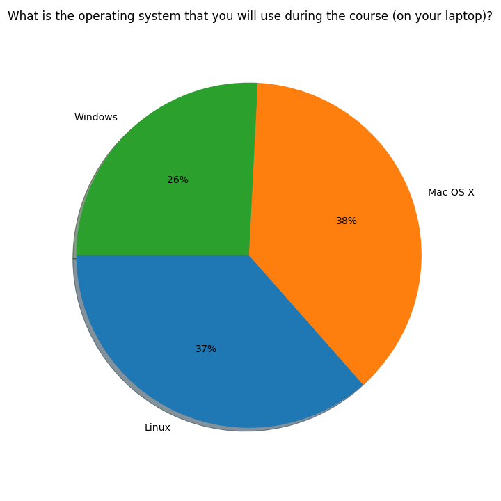
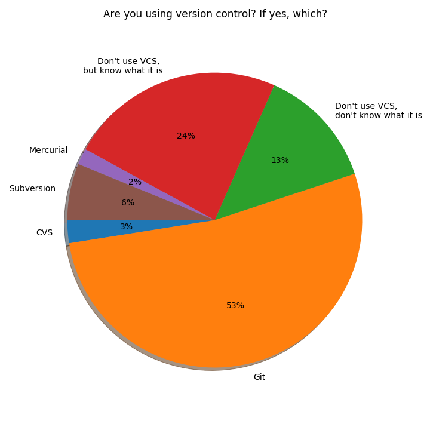
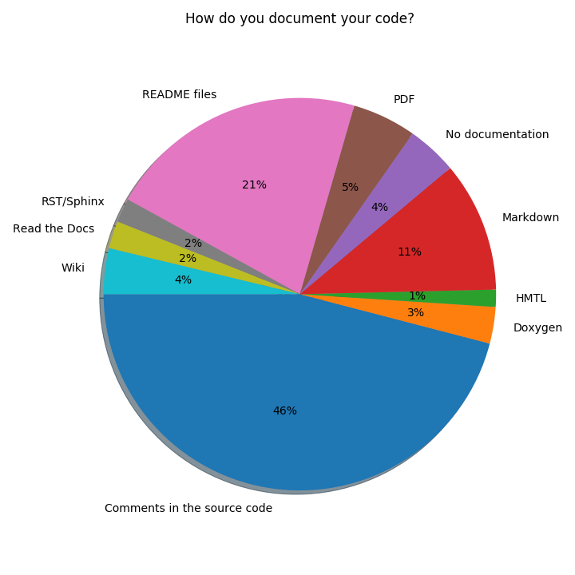
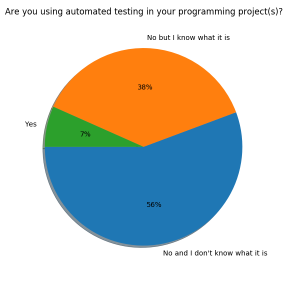
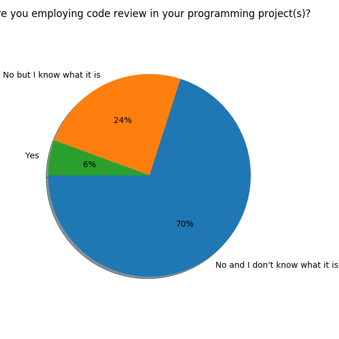

# CodeRefinery pre-workshop survey

Participants of CodeRefinery workshops are asked to fill a pre-workshop 
survey before attending the workshop. In this survey we collect information 
on previous experience with various tools and programming practices.

The survey includes the following questions:

- What is the operating system that you will use during the course (on your laptop)?
- Which version of operating system are you using? If your operating system is Linux, which distribution are you using? This will help us to create more targeted installation instructions.
- Are you using version control? If yes, which?
- Which programming languages are you using or will you use in your projects?
- Are you using automated testing in your programming project(s)?
- Are you using code coverage analysis in your programming project(s)? These are tools and services like Gcov, Cobertura, Codecov, Coveralls, Code Climate, etc.
- Are you employing code review in your programming project(s)?
- Are you using the Travis or Jenkins or GitLab CI continuous integration service in your programming project(s)?
- How do you document your code?
- Are you using a web-based repository for your code(s)? Which ones?
- How would you describe your programming experience?
- How comfortable are you with the Unix/Linux command line working in a terminal window?
- Are you using an integrated development environment (IDE) for your programming project(s)?
- Please specify your main academic discipline. Please take the entry which is closest to your main field of study/work.
- Please select the sessions that you are most interested in.
- What do you expect to get from this course?

## License conditions
This work is licensed under CC 4.0 BY, see the file LICENSE

### Attribution
When using the data from the CodeRefinery post-workshop survey, please state following attribution:
"Post-workshop survey" by [CodeRefinery](https://coderefinery.org) is licensed under CC BY 4.0

## Processing steps
[A script](preprocess-personal.py) 
is first used to remove personal information from the registration data.
Then, a [Jupyter Notebook](pre-workshop-analysis.ipynb) is 
used to analyze the data. 

## Survey results
The main results are reported in the figures below.

#### Gender

    

#### Scientific discipline

#### Operating system

    

#### Version control

    

#### Programming experience
    

#### Programming languages
    

#### Documentation
    

#### Automated testing
    

#### Code review
    

